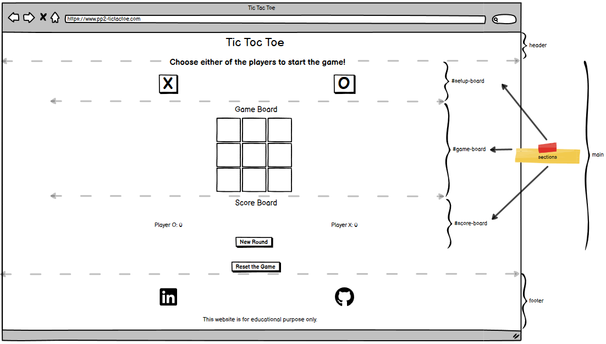
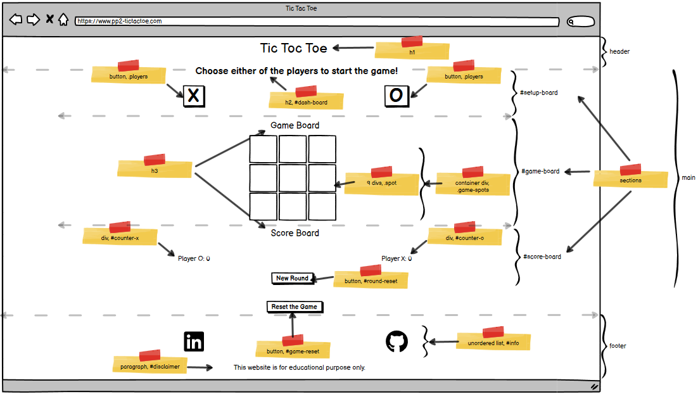

# Tic Tac Toe

## 1. Introduction

Tic Tac Toe game is an ancient board game. According to Wikipedia, the game goes back to 1300 BC [Wikipedia](https://en.wikipedia.org/wiki/Tic-tac-toe). The game board is divided into 3-by-3 boxes. The game is designed to be played by two persons. Each person is designated either of two characters/symbols to play with, conventionally, these are O and X. The players then take turns by placing the symbols in one of the nine boxes. Either player is able to place the player's designated symbol on three boxes arranged horizontally, vertically or diagonally is considered the game winner. In case none of the players is unable to do so, the game is then a tie.

## 2. Development Process

The process followed by the author consists of five phases. These phases are presented below with a detailed account is presented in the subsequent sections.

### 2.1.Research and Selection Criteria

In the research phase the author has conducted a brief search on easy to implement games for the purpose of learning HTML, CSS and JavaScript together. Many resources can be found, the author however settled on the following [Article](https://www.codingnepalweb.com/best-javascript-games-for-beginners/). 
Among the 10 candidates presented in the article, the author chooses to move with Tic Tac Toe game due to three main reasons:
1.	Simple User Interface with minimum graphics
2.	Average logic complexity
3.	Good enough of interactions between the DOM and the JavaScript to become familiar with the concept of DOM manipulation.

### 2.2. Project Objective

From the author's perspective, the main goal of developing this game is to become familiar with JavaScript programming and its interactions with HTML DOM.

#### 2.2.1. Website Owner Objectives

The owner objective is to build an online game that is easy to understand, interface with and play combined with some sort of challenge presented by score accumulation.

#### 2.2.2. Website Visitor Objectives

User objective converges with the site owner's in the sense of finding an online game that is easy to interact with in addition to the provision of some challenge while playing the game by accumulating score when played with a friend. 

### 2.3. Website Requirements

This section describes the general requirements of the game. The author constructs these requirements by translating the aspects briefly reviewed in the previous sections. Subsequently, the author constructs five general design requirements, summarized below:

1. The game design must signal some ancient historical characteristics to reflects a general feeling about it origin
2. The game design consists of three major parts: 
    - Two players each has a symbole of either X or O.
    - A 3-x-3 boxes represents the game board
    - A players' score board to track the records of winning
3. The game design must be simple and easy to navigate as much as possible.
4. The game design must record the score of winning and present it to the user
5. A section in the game page that leads to the author online pages[^1]

[^1]: Although, the last design requirement is not related to the owner’s or visitor’s objective nor to the game design requirements, it is related to sole purpose of pursuing this course, see {project-objective}. That is connect with people who are sharing the same interests to exchange ideas, pursue future project collaborations or simply get feedback for improvement on the author’s work.

### 2.4. Planning

This section intents to describe the planning phase of the project. The planning phase consisits of three sub-phases:
- Wireframes/HTML structure
- Styling
- Game Logic

These sub-phases is desicribed in the following subsections. One can think of the subsequent discriptions as a detailed path as to how each of the 5 requirements presented in the previous section is trasformed into a tangable object, i.e the game website.

==During the execution phase of this project, the author deviated a bit from the presented plan in this section. The pivot is related to converting the confirm method when a user presses the reset button to a modal dialog box. As such, the following subsections does not cover this issue since it was not part of the planning. However, the author provides some details on this in the feature section of this report==.  

#### 2.4.1. Wireframes

This section is designed to provide a high-level overview about the early design thinking of the Game website. The main purpose of these wireframes is to aid the design of the HTML website without delving into what style or how the JavaScript interacts with the HTML. The main expected outputs of these wireframes are:

- What is the preliminary layout of the website?
- What is the preliminary structure of the HTML page?
- What is the preliminary naming used for HTML elements IDs and Classes?

##### 2.4.1.1 Preliminary layout of the website

Using Balsamiq Wireframes, the Game page is presented in three different viewing senarios. These are Smartphone, Tablet and Desktop. 

- Smartphone Layout

- Tablet or Desktop Layout

##### 2.4.1.2 Preliminary structure of the HTML page

Following the wireframes' layout presented on section 2.3.3., the high-level html structure is constructed. The structure is shown in the image below. 

As shown in the figure above, the HTML structure is divided into three parts:

- Header: The header contains the title of the game.
- Main: The main contains three sections, these are: Setup Board, Game Board and Score board.
- Footer: The footer contains two types of information; these are links to the author's LinkedIn and GitHub websites.

##### 2.4.1.3. Preliminary naming used for HTML elements IDs and Classes

The following image is devoted to give additional resolution to the previous subsection by elaborating further on the elements contained in the body of the HTML page. In addition, the image provides further color on the IDs and Classes naming strategy that the author intends to implement to develop the HTML page and subsequently will be used for the page styling and to manipulate the page by the JavaScript code.

#### 2.4.2. Styling

One of the website requements is to present the game with an ancient charactertic touch. This is to refelct the history of the game origin. Towards achieving this, the author opts to present the game as it is played on an old paper or leather scroll background. To constuct such background, the author uses [ChatGPT](https://chat.openai.com/auth/login?sso) to create the background. The players then use black ink to handright the game board and later the score as the game goes.

##### 2.4.2.1 Color

As you might have already guessed, the background image is used as the basis for color extraction. The process of selection is described below:

1. Color Candidates

The first step is to extract a pallet of candidate colors from the background image. The author used [Coolors](https://coolors.co/fdf6da-dcbf87-dcb36f-ac8144-744b1e-704116-6b350f-210e03) for that matter. The result is presented in the image below.

.

2. Color Contrast Evaluation

In order to select the most valid color combination, the author uses [Contrast Grid](https://contrast-grid.eightshapes.com/?version=1.1.0&background-colors=&foreground-colors=%23fdf6daff%3B%0D%0A%23dcbf87ff%3B%0D%0A%23dcb36fff%3B%0D%0A%23ac8144ff%3B%0D%0A%23744b1eff%3B%0D%0A%23704116ff%3B%0D%0A%236b350fff%3B%0D%0A%23210e03ff%3B%0D%0A&es-color-form__tile-size=compact&es-color-form__show-contrast=aaa&es-color-form__show-contrast=aa&es-color-form__show-contrast=aa18&es-color-form__show-contrast=dnp) to achieve the result. The figure below shows the result of the evaulation[^2].

[^2]: The author add the black color (#000000) to the contrast evaluation to account for the color of the text (the bank ink).

3. Color Selection

The selection of the color is choosen based on the contrast result. The author choose to select the most reliable result that is going with Cornsilk for font and border lines and Licorice for the footer background.

##### 2.4.2.2 Fonts

Since the intention is to use the a handwriting font style to foster the historical characteristic feeling of the game. The author selects Salsa font. [Google fonts](https://fonts.google.com/specimen/Salsa?query=Salsa) is used to find the aforementioned font and import it to the style sheet.

#### 2.4.3. Game Logic

This subsection describes in abstract terms the process followed by the author to construct the initial plan of creating the JavaScript code. 

The process begins with reviewing the Wireframes to extract the following information:

1. Game Inputs 
2. Game Outputs
3. Game Functions

The author then combins these basic constracts with the general logic of the game to create a step wise explanation as to how the code should be constructed.

### 2.5. Execution

This section is devoted to describing the execution phase of the project. The section starts with listing the technologies used to develop the website. Then it presents the result of conducted tests using different test tools. Another subsection is included to explains some of the bugs found during the execution phase. This subsection also presents some of the issues that are identified which deserve some explanations. The section then concludes with a brief deployment procedure followed by the author to deploy the website.  

#### 2.5.1. Technologies Used

The list of techologies used to develop the Tic Tac Toe game of this project are as follows:

1. Hypertext Markup Language (HTML): markup language
2. Cascading Style Sheets (CSS): Style Sheet language
3. JavaScript: Programming language
4. GitHub: Development Platform 
5. Gitpod: Cloud Development Environment
6. Chrome DevTools: Web Development Tools for testing and debugging
7. Other testing tools: Wave, Lighthouse, W3C and JSHint

#### 2.5.2. Website Tests

The website went through multiple tests through out the development stage. The results of these tests provided in this section, however, cover only the final round of tests. 

##### 2.5.2.1 Google Lighthouse

The result of Lighthouse tool tests for both mobile and screen are presented below.

###### Mobile Test

###### Disktop Test

##### 2.5.2.2. Web Accessibility Evaluation (Wave) Tool

The result of the Wave Evaluation Tool test is presented in the figure below:

##### 2.5.2.3. W3C Markup Validation Service

The result of W3C Markup Validation Service for the HTML file is shown below:

##### 2.5.2.4. W3C CSS Validation Service

The result of W3C CSS Validation Service for the CSS file is shown below:

##### 2.5.2.5. JSHint

Discuss JavaScript validation.

##### 2.5.2.6. Device Test

The game is tested in different devices (Mobiles, Laptops and Desktop) and different operating systems (Windows 10 and Android). The presentation on all those devices shows no apparent issue. Where applicable, the game is also tested on those devices in landscape and portrait modes.

##### 2.5.2.9. Browser Test

The game is tested in the following browsers:

1. Google Chrome
2. Firefox
3. Edge

No issue is reported.

#### 2.5.3. Bugs

##### 2.5.3.1. Fixed Bugs

List the bugs that were identified and fixed.

##### 2.5.3.2. Unfixed Bugs

Mention any bugs that have not yet been fixed.

## 4. Deployment

Explain how the website is deployed and any steps needed to deploy it to a new environment.

## 5. Features

### 5.1. Header

Describe the header component of the website.

### 5.2. Main Content

Detail the main content area of the website.

### 5.3. Footer

Describe the footer component.

## 6 Credits

### 6.1 References

List any references used in the development of the project.

### 6.2. Content

Credit the sources of website content.

### 6.3. Tools

List the tools used in the project.

### 6.4. Acknowledgement

I would like to express my gratitude to Mr. David Bowers for his outstanding mentorship. His inputs, feedback and guidance are invaluable. I am looking forward to continuing working with him on the upcoming projects.
I would like also to pass my sincere appreciations to all CI students who have reviewed my project and saved some of their valuable time to write me their views and improvement suggestions. The same sentiment goes to all my friends and family who have provided their suppot and reviewed the project and for the provision of their feedback on the website.

