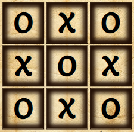
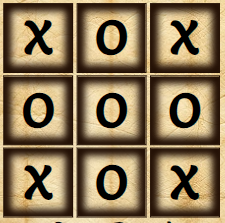

# Tic Tac Toe

## 1. Introduction

Tic Tac Toe game is an ancient board game. According to Wikipedia, the game goes back to 1300 BC [Wikipedia](https://en.wikipedia.org/wiki/Tic-tac-toe). The game board is divided into 3-by-3 boxes. The game is designed to be played by two persons. Each person is designated either of two characters/symbols to play with. Conventionally, these are O and X. The players then take turns by placing the symbols in one of the nine boxes. Either player is able to place the player's designated symbol on three boxes arranged horizontally, vertically or diagonally is considered the game winner. In case where none of the players is able to do so, the game is then a tie.

## 2. Development Process

The process followed by the author consists of five phases, these are:

1. Research
2. Objective
3. Requirements Definition
4. Planning
5. Execution

These phases are presented below with a detailed account of each phase is presented in the subsequent sections.

### 2.1.Research and Selection Criteria

In the research phase the author has conducted a brief search on easy to implement games for the purpose of learning how HTML, CSS and JavaScript work together to build intractive websites. Many resources can be found. The author, however, settled on the following [Article](https://www.codingnepalweb.com/best-javascript-games-for-beginners/) to choose the project candidate from. 
Among the 10 candidates presented in the article, the author chooses to move with Tic Tac Toe game. Three main reasons behind the author choice:
1.	Simple User Interface with minimum graphics
2.	Average logic complexity
3.	Good amount of interactions between the DOM and the JavaScript. This make it an ideal playing ground for the author to become familiar with the concept of DOM manipulation.

### 2.2. Project Objective

The second phase of the project is project objective definition. From the author's perspective, the main goal of developing this game is to become familiar with JavaScript programming and its interactions with HTML DOM and the CSS.

#### 2.2.1. Website Owner Objectives

The owner objective is to build an online game that is easy for the user to:

- Understand
- Interface with 

The game should also be combined with some sort of challenge reflected by score accumulation.

#### 2.2.2. Website Visitor Objectives

In addition, the game is capable of provisioning some challenge while playing the game. This can be done by simply accumulating a score when played with a friend.

### 2.3. Website Requirements

The third phase of the project is related to requirements definition. In this section, the author describes the general requirements of the game. The author constructs these requirements by translating the aspects briefly reviewed in the previous sections. Subsequently, the author constructs five general design requirements, summarized below:

1. The game design look must signal some ancient characteristics to reflect a general feeling about the game origin.
2. The game design consists of three major parts: 
    - Two players each has a symbol of either X or O.
    - A 3-x-3 boxes represent the game board.
    - A players' score board to track the records of winning.
3. As much as possible, the game design must be simple and easy to navigate.
4. The game design must record the score of winning and present it to the user.
5. A section in the game page that leads to the author online pages [^1].

[^1]: The last requirement is not related to the owner’s or visitor’s objectives nor to the game design requirements. It is, however, related to the sole purpose of pursuing this course, see Project Objective section. That is to connect with people who share the same interests with the author. That is in order to learn from other people, exchange ideas, pursue future project collaborations or simply get feedback for improvement on the author’s work.

### 2.4. Planning

This section describes the fourth phase, the planning phase, of the project. The planning phase consisits of three sub-phases:
- Wireframes/HTML structure
- Styling
- Game Logic

These sub-phases is desicribed in the following subsections. One can think of the subsequent discriptions as a detailed path as to how each of the 5 requirements presented in the previous section is to be trasformed into a tangable object, i.e the game website.

==During the execution phase of this project, the author deviated a bit from the presented plan in this section. The pivot is related to converting the confirm method when a user presses the reset button to a modal dialog box. As such, the following subsections does not cover this issue since it was not part of the planning. However, the author provides some details on this in the feature section of this report==.  

#### 2.4.1. Wireframes

This section is designed to provide a high-level overview about the early design thinking of the Game website. The main purpose of these wireframes is to aid the design of the HTML website without delving into what style or how the JavaScript interacts with the HTML. The main expected outputs of these wireframes are:

- What is the preliminary layout of the website?
- What is the preliminary structure of the HTML page?
- What is the preliminary naming used for HTML elements' IDs and Classes?

##### 2.4.1.1 Preliminary layout of the website

Using Balsamiq Wireframes, the Game page is presented in three different viewing senarios. These are Smartphone, Tablet and Desktop. 

- Smartphone Layout

- Tablet or Desktop Layout

##### 2.4.1.2 Preliminary structure of the HTML page

Following the wireframes' layout presented above, the high-level html structure is constructed. The structure is shown in the image below. 

As shown in the figure above, the HTML structure is divided into three parts:

- Header: The header contains the title of the game.
- Main: The main contains three sections, Setup Board, Game Board and Score board.
- Footer: The footer contains two types of information; these are; links to the author's LinkedIn and GitHub websites and the second type of information is a general disclaimer.

##### 2.4.1.3. Preliminary naming used for HTML elements IDs and Classes

The following screenshot is devoted to give additional resolution to the previous subsections. this is done by elaborating more on the elements contained in the body of the HTML page. In addition, the screenshot provides further color on the IDs and Classes naming strategy that the author intends to implement to develop the HTML page. And subsequently, these namings will be used for the page styling and to manipulate the page by the JavaScript code.

#### 2.4.2. Styling

One of the website requements is to present the game with an ancient characteristic touch. This is in order to refelct the history of the game origin. Towards achieving this, the author opts to present the game as it is played on an old paper or on a leather scroll background. To constuct such background, the author uses [ChatGPT](https://chat.openai.com/auth/login?sso) to create the background image. The players then use black ink to handright the game board with symboles and later to record the score as the game goes.

##### 2.4.2.1 Color

As you might have already guessed, the background image is used as the basis for color extraction. The process of colors selection is described below:

1. Color Candidates

The first step is to extract a pallet of candidate colors from the background image. The author used [Coolors](https://coolors.co/fdf6da-dcbf87-dcb36f-ac8144-744b1e-704116-6b350f-210e03) for that matter. The result is presented in the image below.

.

2. Color Contrast Evaluation

In order to select the most valid color combination, the author uses [Contrast Grid](https://contrast-grid.eightshapes.com/?version=1.1.0&background-colors=&foreground-colors=%23fdf6daff%3B%0D%0A%23dcbf87ff%3B%0D%0A%23dcb36fff%3B%0D%0A%23ac8144ff%3B%0D%0A%23744b1eff%3B%0D%0A%23704116ff%3B%0D%0A%236b350fff%3B%0D%0A%23210e03ff%3B%0D%0A&es-color-form__tile-size=compact&es-color-form__show-contrast=aaa&es-color-form__show-contrast=aa&es-color-form__show-contrast=aa18&es-color-form__show-contrast=dnp) to achieve the result. The figure below shows the result of the evaulation [^2].

[^2]: The author add the black color (#000000) to the contrast evaluation to account for the color of the text (the bank ink).

3. Color Selection

The selection of the color is choosen based on the contrast result. The author chooses to select the most reliable result that is going with Cornsilk for font and border lines, Licorice for the footer background, and finally black for the reset of the texts.

##### 2.4.2.2 Fonts

Since the intention is to use a handwriting font style to foster the historical characteristic of the game, the author selects Salsa font. [Google fonts](https://fonts.google.com/specimen/Salsa?query=Salsa) is used to find the aforementioned font and import it to the style sheet.

#### 2.4.3. Game Logic

This subsection describes in abstract terms the process followed by the author to construct the initial plan of creating the JavaScript code. 

The process begins with reviewing the Wireframes to extract the following information:

1. Game Inputs 
2. Game Outputs
3. Game Functions

The author then combins these basic constracts with the general logic of the game to create a step wise explanation as to how the code should be constructed.

To some extend, the draft of the game logic converges reasonably with the implemented code. The major disruption happens when the author introduces the modal reset message in the later stages of the execution phase (initially the plan is to go with confirm method). The introduction of the modal reset message has negatively impacted the quality of the code along the following dimensions:

- Clean Code quality
- Significant increase in the number of global variables
- Time

This is considered as one of the majors lessens-learned from this project.

### 2.5. Execution

This section is devoted to describing the fourth phase of the development process, that is the execution phase. The section starts with listing the technologies used to develop the website. Then it presents the result of conducted tests. Another subsection is included to explain some of the bugs found during the execution phase. This subsection also presents some of the issues that are identified which deserve some explanations. The section then concludes with a brief deployment, cloning, forking procedures.

#### 2.5.1. Technologies Used

The list of techologies used to develop the Tic Tac Toe game of this project are as follows:

1. Hypertext Markup Language (HTML): markup language
2. Cascading Style Sheets (CSS): Style Sheet language
3. JavaScript: Programming language
4. GitHub: Development Platform 
5. Gitpod: Cloud Development Environment
6. Chrome DevTools: Web Development Tools for testing and debugging
7. Other testing tools: Wave, Lighthouse, W3C and JSHint

#### 2.5.2 Test Resutls

The test results is summrized in the table below. For detailed disscusions of the test please visit the [test.md](test.md) file. 

| Test ID No. | Test Name | Test Result | Test Comment|
| ----------- |---------- |------------ |------------ |
| 1 | Google Lighthouse | No Errors/Warnings | Mobile and Desktop|
| 2 | Web Accessibility Evaluation (Wave) Tool | No Errors/Warnings | NO Comment|
| 3 | W3C Markup Validation Service | No Errors/Warnings | No Comment|
| 4 | W3C CSS Validation Service | No Errors and One Warning | Warning message: Imported style sheets are not checked in direct input and file upload modes. This is related to google fonts imported font|
| 5 | JSHint | No Errors/Warnings | No Comment|
| 6 | Device Test | No Errors/Warnings | Test conducted on Mobiles, Laptops and Desktop, Windows 10 and Android and where applicable: landscape and portrait modes|
| 7 | Browser Test | No Errors/Warnings | Google Chrome, Firefox and Edge|

#### 2.5.3. Bugs

This section provides a detailed account of most prominent bugs that are successfully fixed. Moreover, the section contains an additional subsection that covers the unfixed bugs.

##### 2.5.3.1. Fixed Bugs

The following bugs are resolved. the list of bugs presented in accordance to their time of occurrence over the course of the game development. The list does not cover the complete bugs encountered during the development but rather the most prominent ones.

Important Note: Couple of these bugs is resolved by inserting the function in question into ChatGPT console. The ChatGPT then provides the resolution, see the comment columns for more information.

| Bug ID No. | Bug Position | Bug Discription | Bug Solution | Comment|
| -----------| ----------- |---------- |------------ |------------ |
|1| startTheGame function | Buttons are not mutually Exclusive | Introducing a gating mechanism by invoking a variable that takes true and false values to deactivating the other button | The solution is suggested by ChatGPt|
|2| fillTheSpots function | removeEventListener does not work properly leading to double readings of the playingsSpots array | Declare an anonymous function as variable. The declaration must happen outside the handler of the eventlistener. Store the result of listening in an array, when remove the event listener use the stored array as the eventHandler of removeEvent listener as apposed to the declared variable| The author declares the anonymous function, but the problem persists, the rest of the solution is suggested by ChatGPt| 
|3| gameResultEvaluation function | The outputs of the function are always either true or undifined. This prevents the author from extracting draw result | Inroducing two if conditions, winner-not-found and drawCondition | |
|4| startTheGame function | removeEventListener does not work properly leading to double readings of the playingsSpots array | Declare an anonymous function as variable. The declaration must happen outside the handler of the eventlistener. Store the result of listening in an array, when remove the event listener use the stored array as the eventHandler of removeEvent listener as apposed to the declared variable| The solution is inspired by the solution provided by ChatGPT presetned in Bug Id No. 2| 
|5| resetRoundFunction | For the first game load and once a user clicks the reset button, an error appears complaining about listenedToCharacter is not defined | Deactivating the reset button if the listendToCharacter is not an object | |
|6|  resetRoundFunction | similar to bug no. 5 | similar to bug no. 5 | |
|7| returnToGame function | although the function performs the return as expected, multiple game senarios are not covered, e.g. what if no player is selected | Chain of multiple if statements are introduced to account for each senario | |
|8| returnToGame function | The game does not allow the user to select a player to start the new round if no reset is selected. The game does not allow the user to continue if the no is pressed in the middle of the round. The user has to start new round to proceed | improve the logic of the multiple if statements inside the function | |
|9| fillTheSpots function | If a player clicks twice on a spot, the next player when clicks, the newly selected spot will show the earlier player's character | include once: true to the addEventlisenter | |

##### 2.5.3.2. Unfixed Bugs

No bugs are observed after multiple bug fixes and tests. However, the author observes peculiar game scenarios. Although the author does not consider these as bug, he decides to mention them here and give some explanation.

Now you might ask, why the author does not consider this as a bug?The reason the author believes this is not a bug, is because the scenario is not based on a realistic players' choices. Hence, it should not occur in real game competing setting.

1. Peculiar Round Result scenarios

There are two scenarios where the game logic doubls the score of the win. In other words, instead of giving the winner one point, it gives the winner 2 points. 
Such scenario happens when both players decide to break the basic principle of the game rule. That is neither of them is playing for winning nor for tie. Below two screenshots show these scenarios and an explanation as to how this might happen.

As it can be seen from the screenshots above, the issue happens when the same character occupies two diagonals or one vertical and one horizontal. Such situation can only happen when both players decide not to compete. It happens when the first player chooses either the first spot or the second spot. Then the players take turns choosing only the outer spots sequentially. The last empty spot will be the one in the middle. That is exactly the one the completes either the two diagonals and one vertical and one horizontal. Try it yourself.

## 2.5.4. Deployment, Clone and Fork Procedures

The following procedure is implemented for deployment:

1. In the project repository go to settings
2. Under Code and Automation, go to pages
3. Under Build and deployment, choose to deploy from branch
4. Under branch, select main
5. Now select save
6. Wait for couple of minutes to the website to go online

The following procedure is implemented to clone from the GiTHub repo into Gitpod:

1. Go to your repositories 
2. Click on the new created project repository
3. Go to the code in the upper right corner
4. Click on the Code dropdown menu
5. Select local 
6. Select Clone/HTTPs
7. Copy the url provided
8. Open new browser tap
9. Open your Gitpod Workspace
10. Create new workspace
12. Click on select new Repository
13. Paste the url in input window
13. Click continue

For any person interested to work on the source code of this project, here is the procedure that needs to be followed to make a fork.

1. Go to ahmedcodein repositories
2. Click on TicTacToc repo
3. In the upper right corener, click of fork drop down menu
4. Click on create new fork
5. Create new fork window opens
6. Select the owner of the repo
7. Add a repo name
8. Add a discription if needed
9. Click create fork 

## 3. Features

This section summarizes the final look of the game website. It discusses each part of the website and provides some colors to its purpose.

### 3.1. Header

This first part of the game website is the header. The header presents the name of the game in black font. See the figure below:

### 3.2. Main

The main contains three parts. Each part contains specific functionality trigged either directly by the user or by an event resulted from the user previous action.

#### 3.2.1. The Setup Board

The setup board is divided into two parts. The dashboard and the players characters. See the screenshot below.

 ##### 3.2.1.1  The Dashboard

 The dashboard is responsible for leading the user as to what needs to be done or where the game is in any moment during the game play. For example, when the website is loaded, the dashboard informs the user that choosing a character is needed to start the game. See the screen shot below.

 

 Once the game starts the dashboard present whose turn is and continue to do so until the round is concluded. See the screenshot below.

  

If either of the players wins or a tie event happens, the dashboard will announce the game final status. See the two screenshots below.

 ##### 3.2.1.2  The Players Characters

 The second part consists of two buttons each represents a character to be chosen by the users. Once a user pick one of the characters the second user will automatically be assigned the other character. A screenshot is included her to show the first part of the setup board.

 

#### 3.2.2. The Game Board
The game board contains the nine spots that shall be populated by the users assigned characters. See the screen shot below.

 

#### 3.2.3. The Score Board

The score board consists of three parts. The first part is responsible for showing the score of each player. The second part provides a way for the user to reset the game or reset the round. The third part contains a hidden message that popups only when user wants to reset the game. The latter part is added at later stages of the development. Hence, it does not appear in the Wireframes subsection. See the screen below, the third part is hidden here.

 

##### 3.2.3.1 Scores

Each player has its own counter to count the number of rounds a user won. This information is provided in the scores part of the score board. See the screen shot below.

 

##### 3.2.3.2 Rest Buttons

The second part consists of two buttons. One provides the user with the possibility of resetting the game, while the other provides the players with the possibility of resetting the round without setting back the total score to zeros. See the screen shot below.

 

##### 3.2.3.3 The Reset Message

The final part of the score board is the reset message. This message only appears when either of the players presses the game reset buttons. It is there to make sure no player is accidently press the game reset. See the screen shot below.

 

### 3.3. Footer

The last part of the website body is the footer. It contains two components. The first component provides links to the author’s online pages. It is put there to facilitate a communication media for those how are interested to connect with the author to exchange ideas, learn from each other or collaborate on future projects.
The second component is a disclaimer stating the context within which the author develops this website. See the screen shot below.

 

 ### 3.4. Favicon

 The last part of the page is the Favicon. The figure below shows the favicon. The original image is a screenshot of two spots filled with players characters. Then the image is converted into a favicon by using [Favicon Generator](https://www.favicon.cc/?).

   

## 4 Future Work

The author suggests the following list to be considered as future work. The list is arranged with respect to its relevant priority. More weight is generally given to the aspects that support code readability and maintainability.

1. Reduce the number of global variables.
2. Reduce the JavaScript code by removing any duplications. Then, combine the representative lines and include them in standalone functions.
3. Some of the getElementsBy.. or getElementById.. are repeatedly used in multiple positions. Reducing them by declaring a dedicated variable can reduce the verbose in the code.
4. Some of the CSS properties  with similar values are repeatedly used in multiple rules. Defining them in single classes can reduce the verbose of the style sheet.
5. Make the game possible to be played with the computer.
6. Make the game possible to be played remotly online between two players.

## 5 Credits

### 5.1 References

1. Code institute Learning Materials.
2. Code Institute Walkthrough projec: Loving Math.
3. [ChatGPT](https://chat.openai.com/auth/login?sso)
4. Create a Simple Tic Tac Toe Game with JavaScript, HTML & CSS for Beginners | 2022 Tutorial, [Coding With Siphiwo](https://www.youtube.com/watch?v=oZrp3Atkz18).
5. 10 Easy JavaScript Games for Beginners with Source Code, [CodingNepal](https://www.codingnepalweb.com/best-javascript-games-for-beginners/).
6. JavaScript Tutorial | Creating a Modal with JavaScript | Part 1, [
Academind
](https://www.youtube.com/watch?v=o5ffh3KUaTM).
7. David Bowers, BlackJack game, [BlackJack GitHub Repo](https://github.com/dnlbowers/blackjack).
8. [JavaScript forEach() – JS Array For Each Loop Example by Joel Olawanle](https://www.freecodecamp.org/news/javascript-foreach-js-array-for-each-example/#:~:text=how%20they%20work.-,JavaScript%20forEach(),can%20be%20of%20any%20datatype.)
9. [W3 School](https://www.w3schools.com/css/).
10. [Wikipedia](https://en.wikipedia.org).

### 5.2. Content and Tools

1. The Background image is generated by [ChatGPT](https://chat.openai.com/auth/login?sso)
2. The icons of the footer is downloaded from Font Awesome, [Font Awesome](https://fontawesome.com/).
3. Google fonts is imported to the stylesheet, [Google fonts](https://fonts.google.com/).
4. Wordcounter is used to track the number of characters of each git commit, [Wordcounter](https://wordcounter.net/character-count).
5. [Coolors](https://coolors.co/fdf6da-dcbf87-dcb36f-ac8144-744b1e-704116-6b350f-210e03).
6. [Contrast Grid](https://contrast-grid.eightshapes.com/?version=1.1.0&background-colors=&foreground-colors=%23fdf6daff%3B%0D%0A%23dcbf87ff%3B%0D%0A%23dcb36fff%3B%0D%0A%23ac8144ff%3B%0D%0A%23744b1eff%3B%0D%0A%23704116ff%3B%0D%0A%236b350fff%3B%0D%0A%23210e03ff%3B%0D%0A&es-color-form__tile-size=compact&es-color-form__show-contrast=aaa&es-color-form__show-contrast=aa&es-color-form__show-contrast=aa18&es-color-form__show-contrast=dnp).
7. [Favicon Generator](https://www.favicon.cc/?).
8. [Balsamiq Wireframes](https://balsamiq.com/wireframes/desktop/).
9. [Image Resizer](https://redketchup.io/image-resizer).
10. [Markdown Guide](https://www.markdownguide.org/cheat-sheet/).
11. [Am I Responsive?](https://ui.dev/amiresponsive).

### 5.3. Acknowledgement

I would like to express my gratitude to Mr. David Bowers for his outstanding mentorship. His inputs, feedback and guidance are invaluable. I am looking forward to continuing working with him on the upcoming projects.
I would also like to pass my sincere appreciations to all CI students who have reviewed my project and saved some of their valuable time to write me their views and improvement suggestions. The same sentiment goes to all my friends and family who have provided their suppot and reviewed the project and for provisioning their feedback on the website.

