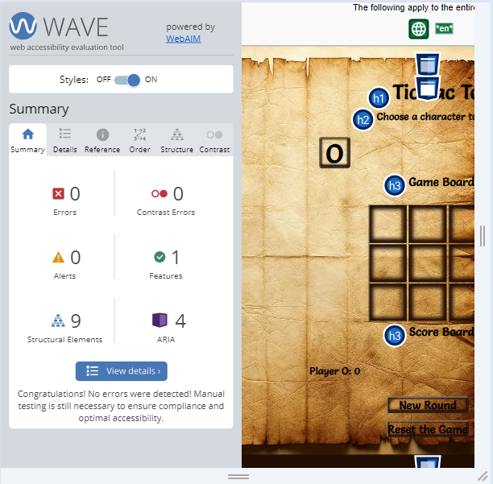
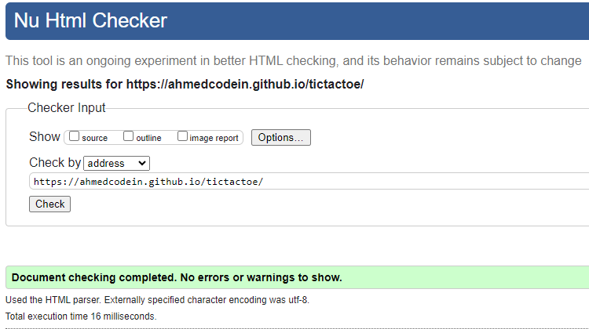
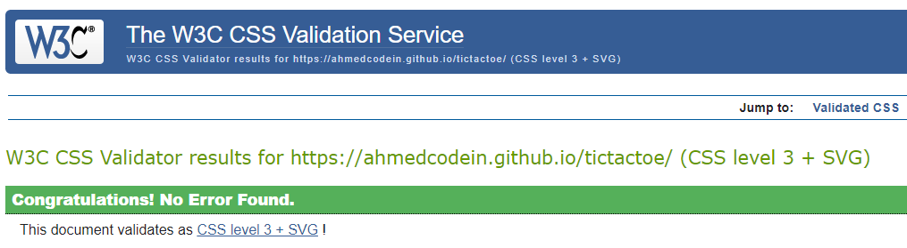
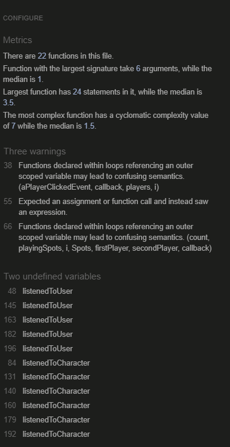
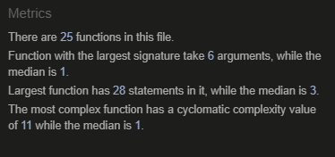

# 1. Test Result

This document is devoted to provide a detailed test summary conducted for the Tic Tac Toe project.
The website went through multiple tests through out the development stage. The results presented in this file, however, cover only the final round of tests. 

##### 1.1 Google Lighthouse

The result of Lighthouse tool tests for both mobile and screen are presented below.

###### Mobile Test

###### Desktop Test

##### 1.2. Web Accessibility Evaluation (Wave) Tool

The result of the Wave Evaluation Tool test is presented in the figure below:

##### 1.3. W3C Markup Validation Service

The result of W3C Markup Validation Service for the HTML file is shown below:

##### 1.4. W3C CSS Validation Service

The result of W3C CSS Validation Service for the CSS file is shown below:

##### 1.5. JSHint

The final JShint test resuloved is cleared with no errors or warnings. The discription below provide detailed status of the test result before and after the fix.

The following captures show the result of jshint test result before fixing the warnings.

- JSHint test result before the fixing the warnings

- JSHint test result after fixing the warnings

###### Resolved Warnings

1. The undefined variables warnings are solved by declaring the variables using LET keyward for variable declaration.
2. The first warrning of ""Functions declared within loops referencing an outer scoped variable" is resolved using forEach loop instead of for loop. The solution is adapted from [BlackJack GitHub Repo](https://github.com/dnlbowers/blackjack).
3. Expected an assignment or functin call warning is solved by using if statement.
4. The second warning of "Functions declared within loops referencing an outer scope variable" is resolved using forEach loop instead of for loop. The major difference between resolving this warning and the warning in 3 is in the use of forEach with index. The solution is adapted from:

    - [JavaScript forEach() – JS Array For Each Loop Example by Joel Olawanle](https://www.freecodecamp.org/news/javascript-foreach-js-array-for-each-example/#:~:text=how%20they%20work.-,JavaScript%20forEach(),can%20be%20of%20any%20datatype.)
    - [BlackJack GitHub Repo](https://github.com/dnlbowers/blackjack).

##### 1.6. Device Test

The game is tested in different devices (Mobiles, Laptops and Desktop) with different operating systems (Windows 10 and Android). The presentation on all of those devices shows no apparent issue. Where applicable, the game is also tested on those devices in landscape and portrait modes.

##### 1.7. Browser Test

The game is tested in the following browsers:

1. Google Chrome
2. Firefox
3. Edge

No issue is reported.

Return to [README.md](README.md).